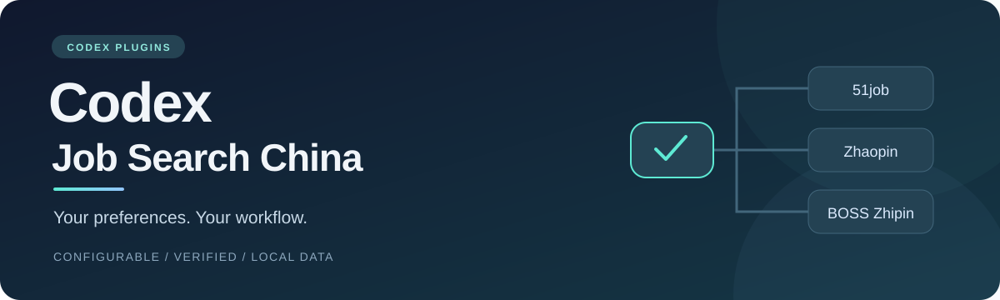

<div align="center">



**把你的求职偏好变成可配置、可核对、可恢复的 Codex 工作流。**

Configurable Codex skills and plugins for **51job / 前程无忧**, **Zhaopin / 智联招聘**, and **BOSS Zhipin / BOSS 直聘**.


[快速开始](#快速开始) · [个性化配置](#个性化配置) · [平台支持](#平台支持) · [隐私](#隐私与数据边界) · [文档](#文档) · [English](#english)

</div>

> **源码测试版**：包含三个可安装的 Skill 插件、配置工具与平台执行模块。离线测试覆盖配置、薪资、岗位绑定、持久尝试和发送保护；本版本尚未进行迁移后的真实平台投递验证。先运行只筛选模式，确认你的环境和页面适配，再启用授权投递。

## 为什么用这个项目

求职偏好应该放在配置里，简历事实应该由你确认，投递结果应该有证据。项目把这些步骤连接起来，支持不同职业方向，同时保持三个平台独立运行。

| 能力 | 你可以做什么 |
| --- | --- |
| **自定义岗位偏好** | 设置城市、关键词、薪资判断方式和排除条件，无需修改脚本 |
| **三个独立插件** | 安装需要的平台，保留独立连接、状态、执行锁和投递记录 |
| **事实约束的材料** | 用已确认的资料匹配岗位和准备文案；缺少事实就提示补充 |
| **逐步启用执行** | 从只筛选、准备草稿，到明确授权后的投递与沟通 |
| **可恢复的发送** | 发送前写入持久尝试记录，超时或断连后先核对再恢复 |
| **本地个人数据** | 配置、资料、凭据和运行记录放在源码目录之外 |

## 快速开始

需要 **Python 3.10+、Node.js 20+ 和 Codex**。首版安装与连接指南以 Windows 为目标。

```powershell
git clone https://github.com/Kerwin-k/codex-job-search-china.git
cd codex-job-search-china

# 按提示填写平台、城市、岗位和薪资偏好
python jobflow.py init

# 检查环境，按输出完善本地事实资料和默认附件名称
python jobflow.py doctor
python jobflow.py validate

# 添加包含三个平台插件的市场
codex plugin marketplace add ./
```

在 Codex 插件目录选择 **Codex 国内求职工作流**，安装需要的平台，然后按 [连接指南](docs/installation.md) 配置浏览器。只安装单个 Skill 也可以，三个包都自带所需脚本。

连接完成后，直接告诉 Codex：

> 使用 51job 工作流，按我的配置筛选岗位，先不投递。

> 使用智联招聘工作流，筛选我的目标岗位，并说明与简历事实的匹配理由。

> 使用 BOSS 直聘工作流，准备打招呼草稿，等我确认本次发送范围。

初始化与 `doctor` 不会操作招聘页面，也不会投递。第一次平台登录、浏览器扩展安装和连接确认需要你完成；[详细安装文档](docs/installation.md) 会逐步说明。

## 个性化配置

配置由初始化工具创建在用户数据目录。用 `python jobflow.py config` 查看位置；用 `config --platform boss` 查看该平台最终生效设置。

```json
{
  "search": {
    "cities": ["北京"],
    "keywords": ["产品设计"],
    "salary": {
      "monthly_floor": 10000,
      "comparison": "lower_bound",
      "unknown": "review"
    },
    "excluded_keywords": [],
    "excluded_employer_types": []
  },
  "execution": {
    "mode": "review",
    "target_count": 5,
    "model": "inherit",
    "reasoning_effort": "inherit"
  }
}
```

以上为合成示例，不代表项目作者或任何真实使用者的偏好。完整格式见 [config.example.json](examples/config.example.json)，字段说明见 [配置指南](docs/configuration.md)。

薪资 **8–12K**、门槛 **10K**：`lower_bound` 比较下限，结果不满足；`upper_bound` 比较上限，结果满足。面议、日薪、时薪或无法识别币种会进入复核。

通过 `platform_overrides` 可以为不同平台设置不同偏好。公共设置和覆盖后的实际配置都经过校验；拼错字段会明确报错。

### 三种工作模式

| 模式 | 行为 | 投递 / 发送 |
| --- | --- | --- |
| `review` | 搜索与筛选，输出匹配理由 | 不触发 |
| `draft` | 准备文案和附件建议 | 不触发 |
| `apply` | 在明确授权范围内执行并核对回执 | 需要本次授权 |

设置 `apply` 本身不会授权投递。最终动作还要核对岗位身份、薪资、附件、重复记录和用户事实；只有直接成功证据才计数。

## 工作流


浏览器、选择器和岗位绑定错误属于技术事件，不能变成岗位拒绝。发送结果不明确时保留尝试记录，先核对平台状态；不通过重复点击“确认”是否成功。

## 平台支持

| 平台 | 插件 | 连接方式 | 本版验证范围 |
| --- | --- | --- | --- |
| 51job / 前程无忧 | `job-search-51job` | 专属浏览器配置 + 上游 Playwright MCP | 配置、运行时生成、状态与发送保护离线验证 |
| 智联招聘 / Zhaopin | `job-search-zhaopin` | 专属浏览器配置 + 上游 Playwright MCP | 配置、运行时生成、状态与发送保护离线验证 |
| BOSS 直聘 / Zhipin | `job-search-boss` | 本地 Chrome 扩展桥接，UIA 有条件恢复 | 配置、桥接凭据生成、状态与发送保护离线验证 |

三个平台保持独立；首版推荐逐个平台运行。没有承诺其他操作系统、所有页面版本或不受限制的并发执行。验证码与登录由用户处理。

## 隐私与数据边界

公开仓库和发行包只包含通用源码、文档、自制资源与合成示例。以下内容留在使用者本地：

- 真实简历、确认后的履历事实、联系方式和附件名称。
- 个人配置、打招呼文案、浏览器绑定与连接凭据。
- 投递台账、消息回执、尝试记录、技术记录和日志。

发行包根据 [允许清单](release-files.json) 生成，发布检查覆盖内容、文件类型、Git 历史和最终压缩包；不会递归打包工作目录。BOSS 桥接令牌由本地工具随机生成，源码不包含可用的固定令牌。

“本地存储”描述项目自身的数据位置。向 Codex、模型或招聘平台提供资料仍涉及对应服务的数据处理。详见 [SECURITY.md](SECURITY.md)。

## 让 Codex 找到工作流

三个 Skill 具有中文和英文平台名称、具体触发描述和独立入口。安装并启用后，Codex 可按任务匹配；也可以直接调用：

```text
$search-51job-jobs
$search-zhaopin-jobs
$search-boss-jobs
```

仓库包含 `.agents/plugins/marketplace.json`、平台插件清单、`SKILL.md` 与 UI 元数据。名称、说明和 GitHub topics 方便人工搜索与按链接安装。公开仓库并不意味着 Codex 会自动抓取全网项目，也不意味着已进入官方插件目录。

## 文档

| 文档 | 内容 |
| --- | --- |
| [安装与连接](docs/installation.md) | 下载、平台插件、浏览器配置与桥接 |
| [配置指南](docs/configuration.md) | 字段、薪资比较、平台覆盖与事实资料 |
| [执行与恢复](docs/execution.md) | 授权、单次发送、回执、暂停与核对 |
| [来源与依赖](docs/provenance.md) | 项目代码与外部依赖的边界 |
| [贡献指南](CONTRIBUTING.md) | 测试、共享模块同步与发布检查 |
| [隐私与安全](SECURITY.md) | 本地数据、报告问题和凭据处理 |

## 开发与验证

```powershell
python -m unittest discover -s tests -v
node --test tests/policy.test.cjs
python tools/sync_shared.py --check
python tools/release_check.py --history
```

离线测试不会操作真实招聘页面。维护公共模块时先修改 `tools/`，再同步到各 Skill，确保单独安装后仍可运行。

## English

**Codex Job Search China** provides configurable agent skills and plugins for **51job**, **Zhaopin**, and **BOSS Zhipin**. Define your own cities, job keywords, salary policy, exclusions and verified resume facts. Each platform keeps its own browser binding, execution lease, state and receipts.

Start in review mode. Explicit user authorization is required before real applications or recruiter messages. Durable attempts block automatic retries after ambiguous results. User configuration, resumes and credentials stay outside the source tree.

This is a source beta targeting Windows + Codex. Offline regression tests do not establish live platform compatibility. See the installation and execution guides before enabling sends.

## License

[MIT](LICENSE). External dependencies retain their upstream licenses; see [sources and dependencies](docs/provenance.md).
